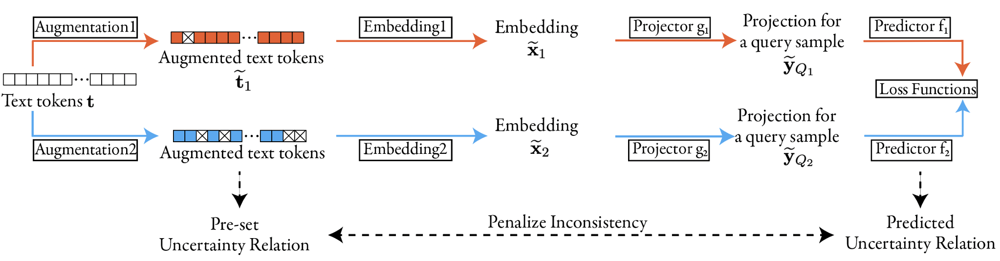

# CLUR: Uncertainty Estimation for Few-Shot Text Classification with Contrastive Learning

This repository contains the code and data for our KDD 2023 paper:

[CLUR: Uncertainty Estimation for Few-Shot Text Classification with Contrastive Learning](https://dl.acm.org/doi/pdf/10.1145/3580305.3599276). 

If you find this work useful, please cite our paper.

```
@inproceedings{he2023clur,
  title={CLUR: Uncertainty Estimation for Few-Shot Text Classification with Contrastive Learning},
  author={He, Jianfeng and Zhang, Xuchao and Lei, Shuo and Alhamadani, Abdulaziz and Chen, Fanglan and Xiao, Bei and Lu, Chang-Tien},
  booktitle={Proceedings of the 29th ACM SIGKDD Conference on Knowledge Discovery and Data Mining},
  pages={698--710},
  year={2023}
}
```

## Overview

Few-shot text classification has extensive application where the sample collection is expensive or complicated. When the penalty for classification errors is high, such as early threat event detection with scarce data, we expect to know ``whether we should trust the classification results or reexamine them.'' This paper investigates the Uncertainty Estimation for Few-shot Text Classification (UEFTC), an unexplored research area. Given limited samples, a UEFTC model predicts an uncertainty score for a classification result, which is the likelihood that the classification result is false. However, many traditional uncertainty estimation models in text classification are unsuitable for implementing a UEFTC model. These models require numerous training samples, whereas the few-shot setting in UEFTC only provides a few or just one support sample for each class in an episode. We propose Contrastive Learning from Uncertainty Relations (CLUR) to address UEFTC. CLUR can be trained with only one support sample for each class with the help of pseudo uncertainty scores. Unlike previous works that manually set the pseudo uncertainty scores, CLUR self-adaptively learns them using the proposed uncertainty relations.  Specifically, we explore four model structures in CLUR to investigate the performance of three common-used contrastive learning components in UEFTC and find that two of the components are effective. Experiment results prove that CLUR outperforms six baselines on four datasets, including an improvement of 4.52\% AUPR on an RCV1 dataset in a 5-way 1-shot setting.

<p align="center">

</p>

## Data
#### Download

We run experiments on a total of 5 datasets. 
The 4 of them are publicly released. For the RCV1, please go to its official website to apply for the permission.
You may download our processed data [here](https://drive.google.com/drive/folders/1t32I9lNUsTReeX62a71BwfGmDfFDueP6?usp=sharing), exclude RCV1.
Once you have the RCV1 permission, please contact jianfenghe@vt.edu for the processed RCV1 datasets and follow the license from RCV1 permission.
Our data split of 20News, Amazon, Huffposts and RCV1 datasets are the same as "Few-shot Text Classification with Distributional Signatures".

Once you have downloaded the data, please put these json files in `data/`.

### Script
For the 1-shot setting, you can run below script.
```
# Train on 20News
python main_uncertainty.py --cuda 0 --way 5 --shot 1 --query 25 --mode train --embedding meta --classifier r2d2 --dataset 20newsgroup --data_path data/20news.json --n_train_class 8 --n_val_class 5 --n_test_class 7 --meta_iwf --meta_w_target --lowb 0.9 --augmargin 0.1 --sec_lowb 0.7 --larger_augmargin --contrastive --feature_aug_mode cutoff --use_unequal --AugLevel sam --modelmode acl --contrast_weight 0.1 --unequal_type 1

# Evaluation on 20News
python main_uncertainty.py --cuda 0 --way 5 --shot 1 --query 25 --mode test --embedding meta --classifier r2d2 --dataset 20newsgroup --data_path data/20news.json --n_train_class 8 --n_val_class 5 --n_test_class 7 --meta_iwf --meta_w_target --train_epochs 10 --snapshot {path to the last saved epoch checkpoint file id} --lowb 0.9 --augmargin 0.1 --sec_lowb 0.7 --larger_augmargin --contrastive --feature_aug_mode cutoff --use_unequal --AugLevel bat --tev_mode acltev --use_auc_roc --individual_eval --use_idk --drop-num 30 --test_episodes 100 --use_auc_roc --use_unequal --use_unequal_tev --modelmode acl --unequal_type 1
```

the `{path to the last saved epoch checkpoint file id}` could be like `{your path to the project}/src/tmp-runs/16947920183606976/67`, where `67` is the last training epoch id with two saved files `67.cls` and `67.ebd`. 


For the 5-shot setting, you can run below script.
```
# Train on RCV1
python main_uncertainty.py --cuda 2 --way 5 --shot 1 --query 25 --mode train --embedding meta --classifier r2d2 --dataset rcv1 --data_path data/rcv1.json --n_train_class 37 --n_val_class 10 --n_test_class 24 --meta_iwf --meta_w_target --lowb 0.9 --augmargin 0.1 --sec_lowb 0.7 --larger_augmargin --contrastive --feature_aug_mode cutoff --use_unequal --AugLevel sam --modelmode clur --contrast_weight 1.0 --unequal_type 1 --patience 30

# Evaluation on RCV1
python main_uncertainty.py --cuda 2 --way 5 --shot 1 --query 25 --mode test --embedding meta --classifier r2d2 --dataset rcv1 --data_path data/rcv1.json --n_train_class 37 --n_val_class 10 --n_test_class 24 --meta_iwf --meta_w_target --train_epochs 10 --snapshot {path to the last saved epoch checkpoint file id} --lowb 0.9 --augmargin 0.1 --sec_lowb 0.7 --larger_augmargin --contrastive --feature_aug_mode cutoff --use_unequal --AugLevel bat --tev_mode acltev --use_auc_roc --individual_eval --use_idk --drop-num 30 --test_episodes 100 --use_auc_roc --use_unequal --use_unequal_tev --modelmode clur --unequal_type 1
```

To use other datadatasets, you can set the below parameters that used in the above scripts.
```
# 20news
--dataset 20newsgroup --data_path data/20news.json --n_train_class 8 --n_val_class 5 --n_test_class 7

# RCV1
--dataset rcv1 --data_path data/rcv1.json --n_train_class 37 --n_val_class 10 --n_test_class 24

# Amazon
--dataset amazon --data_path data/amazon.json --n_train_class 10 --n_val_class 5 --n_test_class 9

# HuffPost
--dataset huffpost --data_path data/huffpost.json --n_train_class 20 --n_val_class 5 --n_test_class 16

# Med-Domain
--dataset medd --data_path data/huffpost.json --n_train_class 13 --n_val_class 7 --n_test_class 9
```


#### Checkpoints
For the checkpoints of our reported results (CLUR-b-3), they are in the [here](https://drive.google.com/drive/folders/1d4VkoIzmOvrN7r7mXXuB5OLBDNTzbhl4?usp=sharing).
You can reproduce our results by using the evaluation script, which replaces the `{path to the last saved epoch checkpoint file id}` accordingly.


#### Dependencies
On a 1080Ti Server:
- Python 3.7 
- PyTorch 1.2.0 
- numpy 1.21.3
- torchtext 0.4.0
- transformers 4.12.3

On a 3090 Server:
- Python 3.8 
- PyTorch 1.8.0 
- numpy 1.17.5 
- torchtext 0.4.0
- transformers 4.10.3

Please adapt one based on your own machine.


#### Acknowledge & License
Our framework is constructed based on "Few-shot Text Classification with Distributional Signatures".
Please follow their MIT license at [here](https://github.com/YujiaBao/Distributional-Signatures).

